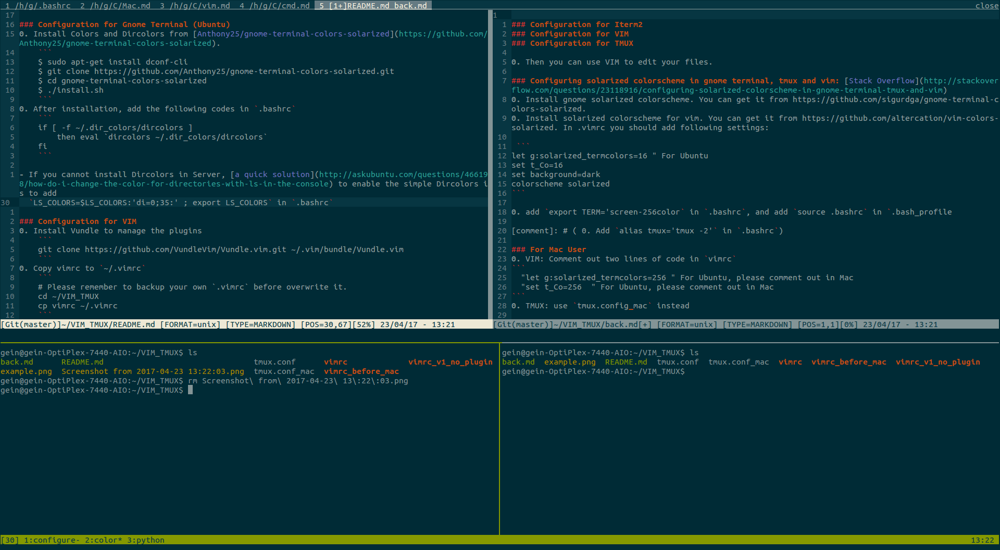
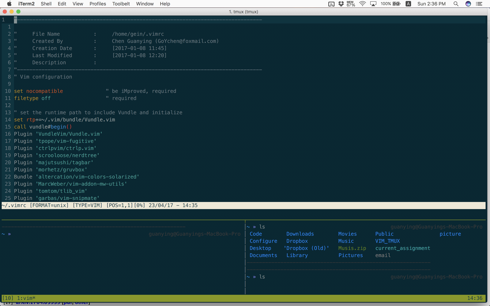

## Solarized Color Scheme For Terminal / iTerm2, Vim, Tmux and SecureCrt
### Table of Contents
* [Examples](#examples)
* [Clone this Repository](#clone-this-repository)
* [Terminal, Vim, Tmux and SecureCrt for Ubuntu](#terminal-vim-tmux-and-securecrt-for-ubuntu)
   * [Configuration for Gnome Terminal](#configuration-for-gnome-terminal)
   * [Configuration for Vim](#configuration-for-vim)
   * [Configuration for Tmux](#configuration-for-tmux)
   * [Configuration for SecureCrt](#configuration-for-securecrt)
* [iTerm2, Vim, Tmux and Securecrt for Mac](#iterm2-vim-tmux-and-securecrt-for-mac)
   * [Configuration for iTerm2](#configuration-for-iterm2)
   * [Configuration for Vim](#configuration-for-vim-1)
   * [Configuration for Tmux](#configuration-for-tmux-1)
   * [Configuration for SecureCrt](#configuration-for-securecrt-1)
* [Some Notes on the Plug-ins of Vim](#some-notes-on-the-plug-ins-of-vim)

### Examples
- Gnome Terminal
  <p align="center">
   
  </p>     

- SecureCrt
  <p align="center">
    
  </p>     
- iTerm2
  <p align="center">
    
  </p>     

### Clone this Repository
```
git clone https://github.com/GoYchen/VIM_TMUX.git ~/VIM_TMUX
```

### Terminal, Vim, Tmux and SecureCrt for Ubuntu
#### Configuration for Gnome Terminal 
0. Install Colors and Dircolors following [Anthony25/gnome-terminal-colors-solarized](https://github.com/Anthony25/gnome-terminal-colors-solarized). 
    ```
    $ sudo apt-get install dconf-cli
    $ git clone https://github.com/Anthony25/gnome-terminal-colors-solarized.git
    $ cd gnome-terminal-colors-solarized
    $ ./install.sh
    ```
0. After installation, add the following codes in `.bashrc`
    ```
    if [ -f ~/.dir_colors/dircolors ]
        then eval `dircolors ~/.dir_colors/dircolors`
    fi
    ```
- If you cannot install Dircolors in server, [a quick solution](http://askubuntu.com/questions/466198/how-do-i-change-the-color-for-directories-with-ls-in-the-console) is to add   
  `LS_COLORS=$LS_COLORS:'di=0;35:' ; export LS_COLORS` in `.bashrc`

#### Configuration for Vim  
0. Install Vundle to manage the plug-ins
    ```
    git clone https://github.com/VundleVim/Vundle.vim.git ~/.vim/bundle/Vundle.vim
    ```
0. Copy vimrc to `~/.vimrc`
    ```
    # Please remember to backup your own `.vimrc` before overwrite it.
    cd ~/VIM_TMUX
    cp vimrc ~/.vimrc
    ```
0. Install the plugins
    ```
    vim ~/.vimrc
    :PluginInstall
    ```
0. Add the following code in `.vimrc` to correctly display color in Gnome Terminal Vim (already done for you)
    ```
    let g:solarized_termcolors=16 
    set t_Co=16  
    set background=dark
    let g:solarized_visibility = "high"
    let g:solarized_contrast = "high"
    colorscheme solarized
    ```
Now, you can use Vim to edit edit your files with Solarized Color scheme. However, the color does not display correctly when you run Vim inside Tmux.

#### Configuration for Tmux
0. Copy `tmux.conf` to `~/.tmux.conf`
0. Add `export TERM='screen-256color` in `.bashrc` 
0. Add `source .bashrc` in `.bash_profile` (Tmux source `.bash_profile` when starting up)

#### Configuration for SecureCrt
0. Install SecureCrt
0. Set Terminal Emulation: in `Options -> Global Options -> Default Session -> Edit Default Settings -> Terminal -> Emulation`, choose `Xterm` and `ANSI Color` under `Emulation options`.
0. Set color scheme to [solarized dark](https://gist.github.com/schmrlng/737c4a1672442bd15b60): open file `~/.vandyke/SecureCRT/Config/Global.ini` and replace the corresponding code patch with the following:
     ```
     B:"ANSI Color RGB"=00000040
      07 36 42 00 dc 32 2f 00 85 99 00 00 b5 89 00 00 26 8b d2 00 d3 36 82 00 2a a1 98 00 ee e8 d5 00
      00 2b 38 00 cb 4b 16 00 58 6e 75 00 65 7b 83 00 83 94 96 00 6c 71 c4 00 93 a1 a1 00 fd f6 e3 00
     ```

### iTerm2, Vim, Tmux and Securecrt for Mac
#### Configuration for iTerm2
0. Reference: [iTerm2 + Oh My Zsh + Solarized color scheme + Meslo powerline font + Powerlevel9k - (macOS)](https://gist.github.com/kevin-smets/8568070)
0. Install iTerm2: `brew cask install iterm2`
0. Install `Oh My Zsh`    
    ```
    sh -c "$(curl -fsSL https://raw.github.com/robbyrussell/oh-my-zsh/master/tools/install.sh)" 
    ```
    After installation, open `~/.zshrc` and set `ZSH_THEME="af-magic"`.
0. Install Powerline fonts (Meslo Font)
    - Download Meslo font from the [github link](https://github.com/powerline/fonts/blob/master/Meslo%20Slashed/Meslo%20LG%20M%20Regular%20for%20Powerline.ttf) and install it.   
    - Set this font in iTerm2 (15px is okay) : `(iTerm -> Preferences -> Profiles -> Text -> Change Font)`
0. Set Terminal Emulation: in `Preferences -> Profiles -> Terminal`, under `"Terminal Emulation"` you have `"Report Terminal Type:"` set to `xterm-256color.`
0. Restart iTerm2 for all changes to take effect.

#### Configuration for Vim
The same as [Vim Configuration for Ubuntu](#configuration-for-vim).

#### Configuration for Tmux
0. Copy `tmux.conf_mac` to `~/.tmux.conf`

#### Configuration for SecureCrt
0. Install SecureCrt
0. Set Terminal Emulation: in `Options -> Global Options -> Default Session -> Edit Default Settings -> Terminal -> Emulation`, choose `Xterm` and `ANSI Color` under `Emulation options`.
0. Set color scheme to [solarized dark](https://gist.github.com/schmrlng/737c4a1672442bd15b60): open file `~/Library/Application Support/VanDyke/SecureCRT/Config/Global.ini` and replace the corresponding code patch with the following:

     ```
     B:"ANSI Color RGB"=00000040
      07 36 42 00 dc 32 2f 00 85 99 00 00 b5 89 00 00 26 8b d2 00 d3 36 82 00 2a a1 98 00 ee e8 d5 00
      00 2b 38 00 cb 4b 16 00 58 6e 75 00 65 7b 83 00 83 94 96 00 6c 71 c4 00 93 a1 a1 00 fd f6 e3 00
     ```
##
### Some Notes on the Plug-ins of Vim
0. [The NERD tree : A tree explorer plugin for navigating the filesystem](http://www.vim.org/scripts/script.php?script_id=1658).  
The NERD tree allows you to explore your filesystem and to open files and directories. It presents the filesystem to you in the form of a tree which you manipulate with the keyboard and/or mouse. It also allows you to perform simple filesystem operations.
    ```
    # We use <F3> to toggle the tree explorer
    nmap <F3> :NERDTreeToggle<cr>
    ```
0. [Tagbar : Display tags of the current file ordered by scope](http://www.vim.org/scripts/script.php?script_id=3465)  
Tagbar is a Vim plugin that provides an easy way to browse the tags of the current file and get an overview of its structure. It does this by creating a sidebar that displays the ctags-generated tags of the current file, ordered by their scope. This means that for example methods in C++ are displayed under the class they are defined in.
    ```
    # We use <F4> to toggle the tree explorer
    nmap <F4> :TagbarToggle<CR>
    ```

0. [The CtrlP Plugin](https://github.com/ctrlpvim/ctrlp.vim)  
Full path fuzzy file, buffer, mru, tag, ... finder for Vim.
You can run the follow command to invoke it
    ```
    <ctrl>+p
    ```
0. [The Vim-fugitive Plugin](https://github.com/tpope/vim-fugitive)  
fugitive.vim may very well be the best Git wrapper of all time.


0. The SnipMate Plugin  
SnipMate aims to provide support for textual snippets, similar to TextMate or other Vim plugins like UltiSnips. 
To install SnipMat plugin, you have to install some dependence
    ````
    " Plugin for snipmate
    Plugin 'MarcWeber/vim-addon-mw-utils'
    Plugin 'tomtom/tlib_vim'
    Plugin 'garbas/vim-snipmate'
    Plugin 'honza/vim-snippets' " Optional
    ````

Hope you enjoy programming with Vim and Tmux. 

**Last Updated: April 23, 2017**


