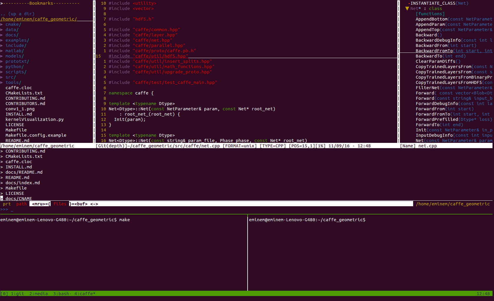

## Confiugration of VIM and TMUX

### Lastes
0. Update to Solarized theme

VIM and TMUX are two of the most helpful tools in Linux/Mac. Combining VIM and Tmux, you can transform your terminal into a powerful development tools.


### Clone this Repository
```
git clone https://github.com/GoYchen/VIM_TMUX.git
```

### VIM 

#### Configuration for VIM
0. Install Vundle to manage the plugins
```
git clone https://github.com/VundleVim/Vundle.vim.git ~/.vim/bundle/Vundle.vim
```

0. Copy vimrc to `~/.vimrc`
```
# Please remember to backup your own `.vimrc` before overwrite it.
cp vimrc ~/.vimrc
```
0. Install the wonderful plugins
```
vim ~/.vimrc
:PluginInstall
```
Vim will automatically install the plugins.

0. Then you can use VIM to edit your files.

### Configuring solarized colorscheme in gnome terminal, tmux and vim: [Stack Overflow](http://stackoverflow.com/questions/23118916/configuring-solarized-colorscheme-in-gnome-terminal-tmux-and-vim)
0. Install gnome solarized colorscheme. You can get it from https://github.com/sigurdga/gnome-terminal-colors-solarized.
After intallatin, add this code in  `.bashrc`

 ```
if [ -f ~/.dir_colors/dircolors ]
    then eval `dircolors ~/.dir_colors/dircolors`
fi
```
0. Install solarized colorscheme for vim. You can get it from https://github.com/altercation/vim-colors-solarized. In .vimrc you should add following settings:

 ```
set t_Co=256
set background=dark
colorscheme solarized
```
0. Add `alias tmux='tmux -2'` in `.bashrc`

### For Mac User
0. VIM: Comment out two lines of code in `vimrc`
```
  "let g:solarized_termcolors=256 " For Ubuntu, please comment out in Mac
  "set t_Co=256  " For Ubuntu, please comment out in Mac
```
0. TMUX: use `tmux.config_mac` instead

#### Some Notes on the plugins and configuration of VIM
0. Color Scheme: gruvbox
gruvbox is heavily inspired by badwolf, jellybeans and solarized. Designed as a bright theme with pastel 'retro groove' colors and light/dark mode switching in the way of solarized. The main focus when developing gruvbox is to keep colors easily distinguishable, contrast enough and still pleasant for the eyes.
```
# Configuration:
let g:gruvbox_contrast_dark='hard'
colorscheme gruvbox
let NVIM_TUI_ENABLE_TRUE_COLOR=1
```
[Github: gruvbox](https://github.com/morhetz/gruvbox)

0. The NERD Tree Plugin 
The NERD tree allows you to explore your filesystem and to open files and directories. It presents the filesystem to you in the form of a tree which you manipulate with the keyboard and/or mouse. It also allows you to perform simple filesystem operations.

```
# We use <F3> to toggle the tree explorer
nmap <F3> :NERDTreeToggle<cr>
```
[The NERD tree : A tree explorer plugin for navigating the filesystem](http://www.vim.org/scripts/script.php?script_id=1658).  

0. The Tagbar Plugin
Tagbar is a Vim plugin that provides an easy way to browse the tags of the current file and get an overview of its structure. It does this by creating a sidebar that displays the ctags-generated tags of the current file, ordered by their scope. This means that for example methods in C++ are displayed under the class they are defined in.
```
# We use <F4> to toggle the tree explorer
nmap <F4> :TagbarToggle<CR>
```
[Tagbar : Display tags of the current file ordered by scope](http://www.vim.org/scripts/script.php?script_id=3465)

0. The CtrlP Plugin
Full path fuzzy file, buffer, mru, tag, ... finder for Vim.
You can run the follow command to invoke it
```
<ctrl>+p
```
[Github: ctrlp.vim](https://github.com/ctrlpvim/ctrlp.vim)

0. The Vim-fugitive Plugin
fugitive.vim may very well be the best Git wrapper of all time.
[Github: fugitive.vim](https://github.com/tpope/vim-fugitive)

0. The SnipMate Plugin
SnipMate aims to provide support for textual snippets, similar to TextMate or other Vim plugins like UltiSnips. 
To install SnipMat plugin, you have to install some dependence
```
" Plugin for snipmate
Plugin 'MarcWeber/vim-addon-mw-utils'
Plugin 'tomtom/tlib_vim'
Plugin 'garbas/vim-snipmate'
Plugin 'honza/vim-snippets' " Optional:
```
#### Old Version of VIMRC
`vimrc_old` does not depend on any plugins.

### TMUX
#### COnfiguration for TMUX
```
cp tmux.conf ~/.tmux.conf
```

We rebind the activation key from `Ctrl+b` to `Ctrl+x` and use the vim-style shortcuts
```
# this kind of configuration can be saw with: show-options -g 
set-option -g base-index 1    # base index, default 0
set-option -g display-time 5000 # duration time of prompt 
set-option -g repeat-time 1000  # duration time of console activation
set-option -g status-keys vi    # keyboard layout, can be set as vi or emacs 
set-option -g status-right "#(date +%H:%M' ')"    #time
set-option -g status-right-length 10 #
set-option -g status-utf8 on # support UTF-8 in status bar 
  
# this kind of configuration can saw with: show-window-options -g
set-window-option -g mode-keys vi  #copy mode, can be set as vi or emacs   
set-window-option -g utf8 on #support UTF-8 in window
  
# change the shortcut of console activation from Ctrl+b to Ctrl+x
set-option -g prefix C-x   
unbind-key C-b   
bind-key C-x send-prefix   
  
# add custom shortcuts
bind-key z kill-session # kill the session
bind-key H select-layout even-horizontal #even-horizontal
bind-key v select-layout even-vertical #even-vertical

# vim style pane selection
bind-key k select-pane -U #up
bind-key j select-pane -D #down
bind-key h select-pane -L #left
bind-key l select-pane -R #right

# reload the ./tmux.config and show
bind r source ~/.tmux.conf \; display "Configuration reloaded!"
```

